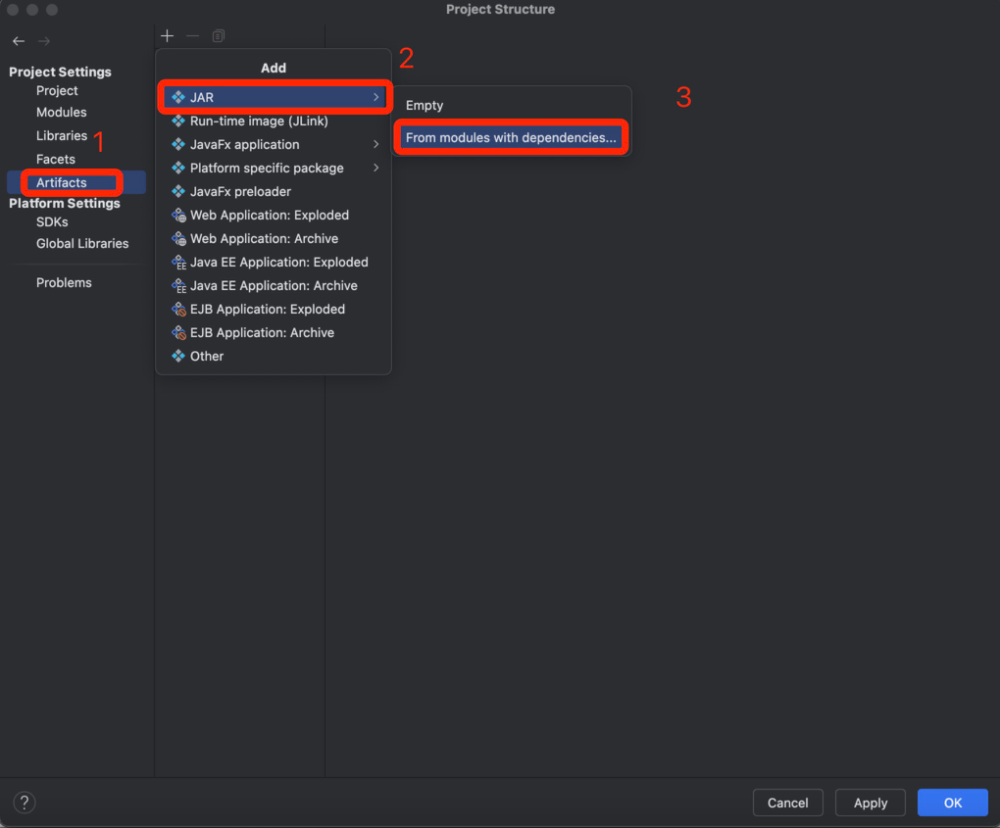
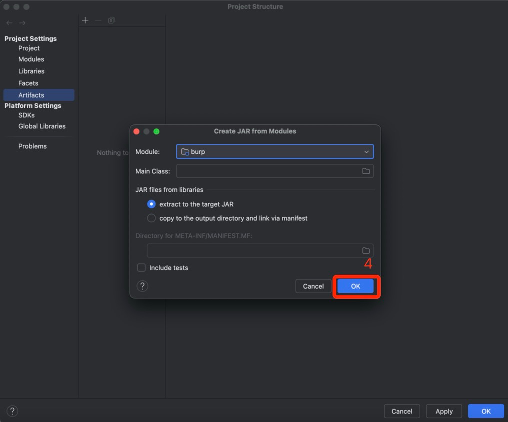
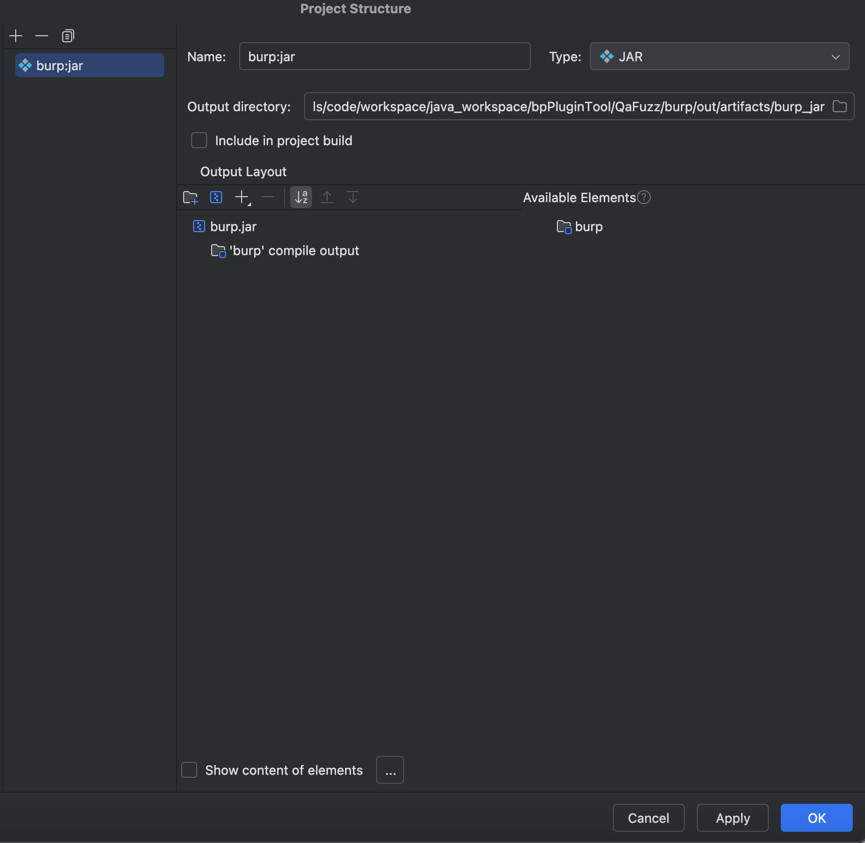
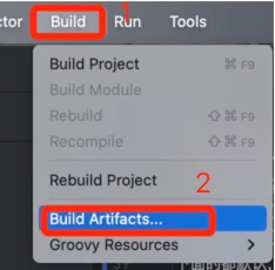
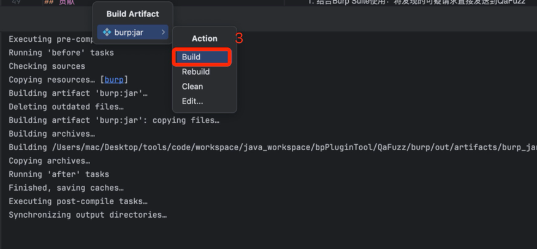

# QaFuzz - 测试域名自动化挖掘工具

## 工具概述
QaFuzz是一款专为安全研究人员设计的自动化工具，用于发现企业测试环境暴露在公网的子域名。通过智能生成测试域名、验证DNS解析和响应状态，帮助挖掘潜在的安全漏洞。

## ✨ 功能特性

| 🎯 智能生成 | 🔍 精准验证 | 🤝 工具联动 |
|------------|------------|------------|
| 自动组合test/dev/stage等子域名 | 验证DNS解析为外网IP | OneScan｜APiKit等 |

## 运行效果
  <!-- 请将截图保存至此路径 -->

## 工具安装
### Burp Suite插件导入即可
1. 安装`QaFuzz`的Burp扩展
   
2. 在QaFuzz工具中，配置需要探测的测试域名关键字，多个关键字以,分割
   
3. 在Burp中右键目标域名 → "Send to QaFuzz"
   

## 怎么打jar包【作者用的jdk11编译】
### 1. 下载好源码后，用idea打开项目，File->Project structure

### 2.下面的都默认，不用点，直接ok就行！

### 3.编译jar包 【windows一样找这个按钮就行】

### 4.然后就会看到out/artifacts/burp_jar目录下打包好的jar文件，直接在burp中导入就行

## 最佳实践
1. 结合Burp Suite使用：将发现的可疑请求直接发送到QaFuzz
2. 联动漏洞扫描工具：将QaFuzz扫描结果发送到OneScan/ApiKit等工具
3. 定期更新子域名字典：添加企业特有的测试环境命名习惯

## 贡献
欢迎提交Issue或Pull Request

## 📊 项目统计

